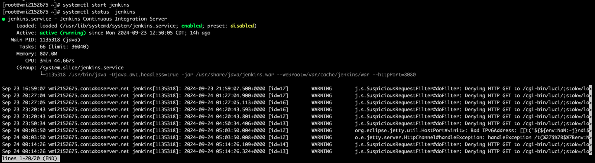
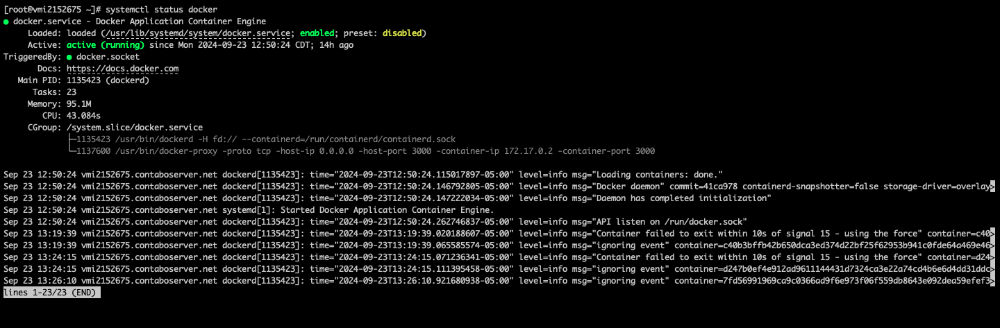
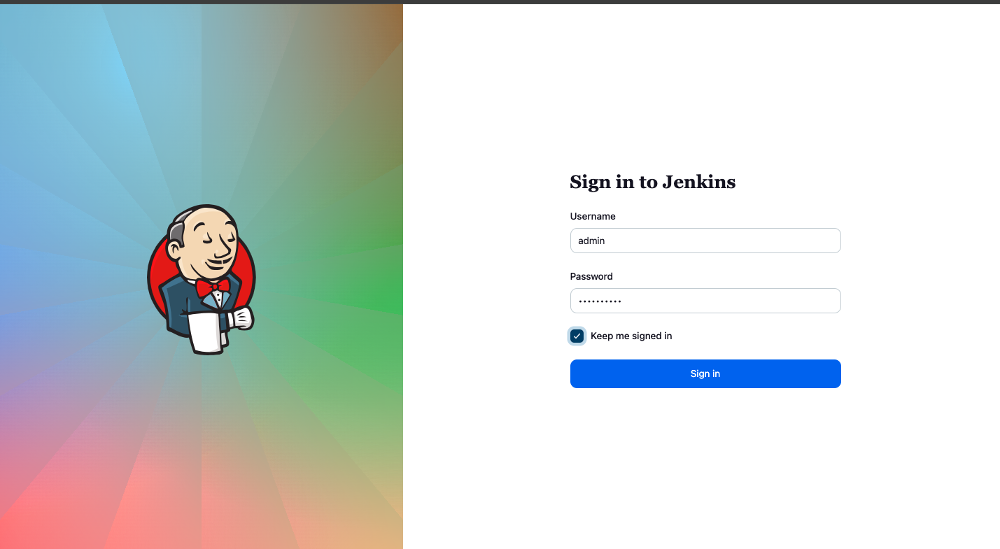
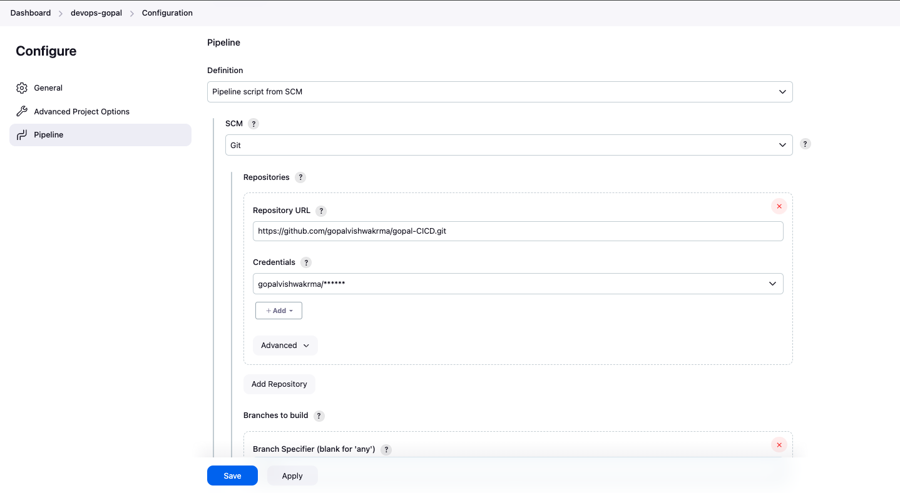
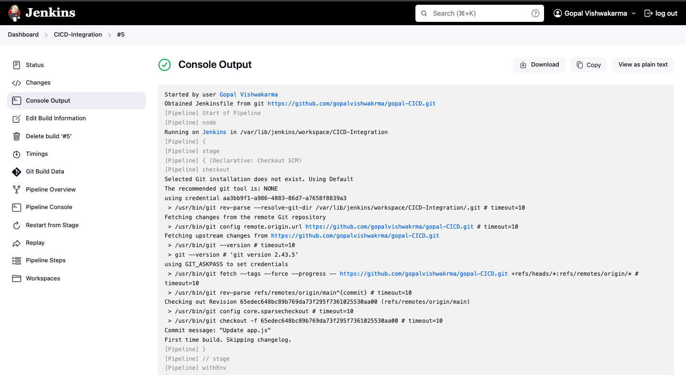
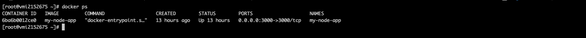
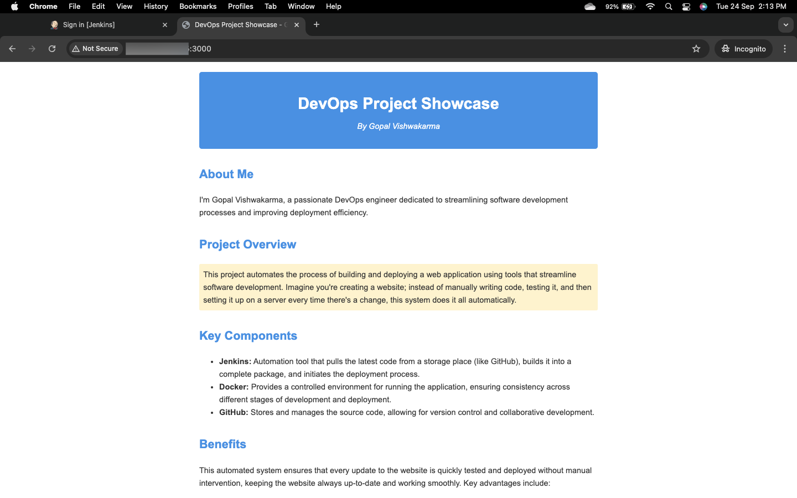

# Seamless Deployment of Node.js Apps with Jenkins and Docker

This project highlights my work automating the build and deployment of a Node.js app using Jenkins and Docker on AlmaLinux. I set up a CI/CD pipeline to automatically pull code from Git, build a Docker image, and deploy the app in a container. This system ensures continuous integration and delivery, streamlining development by eliminating the need for manual updates.

## Table of Contents

1. [Overview](#overview)
2. [Prerequisites](#prerequisites)
3. [Installation Steps](#installation-steps)
4. [Configuration](#configuration)
5. [Usage](#usage)
6. [Troubleshooting](#troubleshooting)

## Overview

This project sets up a robust CI/CD pipeline using the following technologies:

- AlmaLinux as the base operating system
- Jenkins for continuous integration and deployment
- Docker for containerization
- GitHub for version control and webhook integration

The setup allows for automated building and deployment of applications upon code pushes to the repository.

## Prerequisites

- AlmaLinux server
- Root or sudo access to the server
- GitHub account
- Basic knowledge of Linux commands, Git, and Docker

## Installation Steps

### 1. Update System and Install Dependencies

First, update your AlmaLinux system and install necessary dependencies:

```bash
sudo dnf update -y
sudo dnf install -y epel-release
sudo dnf install -y wget git java-11-openjdk-devel
```

### 2. Install Jenkins

Add the Jenkins repository and install Jenkins:

```bash
sudo wget -O /etc/yum.repos.d/jenkins.repo https://pkg.jenkins.io/redhat-stable/jenkins.repo
sudo rpm --import https://pkg.jenkins.io/redhat-stable/jenkins.io-2023.key
sudo dnf install -y jenkins
```

Start and enable Jenkins:

```bash
sudo systemctl start jenkins
sudo systemctl enable jenkins
```

Check Jenkins status:

```bash
sudo systemctl status jenkins
```



### 3. Install Docker

Install Docker using the official repository:

```bash
sudo dnf config-manager --add-repo https://download.docker.com/linux/centos/docker-ce.repo
sudo dnf install -y docker-ce docker-ce-cli containerd.io
```

Start and enable Docker:

```bash
sudo systemctl start docker
sudo systemctl enable docker
```

Check Docker status:

```bash
sudo systemctl status docker
```



Add your user to the docker group:

```bash
sudo usermod -aG docker $USER
```

Log out and log back in for the group changes to take effect.

## Configuration

### 4. Configure Jenkins

1. Open Jenkins in your web browser: `http://your_server_ip:8080`



2. Retrieve the initial admin password:
   ```bash
   sudo cat /var/lib/jenkins/secrets/initialAdminPassword
   ```
3. Use this password to unlock Jenkins, then install suggested plugins and create an admin user.

### 5. Install Necessary Jenkins Plugins

In the Jenkins web interface, install the following plugins:
- Git
- Docker Pipeline
- Pipeline

Restart Jenkins after installation:

```bash
sudo systemctl restart jenkins
```

### 6. Create a Jenkins Pipeline

1. In Jenkins, click "New Item"
2. Enter a project name and select "Pipeline"
3. Configure the pipeline to use your GitHub repository



### 7. Create a Jenkinsfile

Create a `Jenkinsfile` in your GitHub repository root with the following content:

```groovy
pipeline {
    agent any
    stages {
        stage('Checkout') {
            steps {
                checkout scm
            }
        }
        stage('Build Docker Image') {
            steps {
                sh 'docker build -t my-node-app .'
            }
        }
        stage('Run Docker Container') {
            steps {
                sh 'docker stop my-node-app || true'
                sh 'docker rm my-node-app || true'
                sh 'docker run -d --name my-node-app -p 3000:3000 my-node-app'
            }
        }
    }
}
```

### 8. Create a Dockerfile

Create a `Dockerfile` in your repository:

```dockerfile
FROM node:14

WORKDIR /app

COPY package*.json ./

RUN npm install

COPY . .

EXPOSE 3000

CMD ["node", "app.js"]
```

### 9. Configure GitHub Webhook (Optional)

Set up a webhook in your GitHub repository to trigger Jenkins builds on code pushes.

## Usage

1. Push your code to the GitHub repository
2. Jenkins will automatically pull the code, build the Docker image, and deploy your application
3. Access your application at `http://your_server_ip:3000`

To manually trigger a build:
1. Go to your Jenkins project
2. Click "Build Now"
3. Expected console output:



Check running Docker containers:

```bash
docker ps
```



## Last output:



## Troubleshooting

If you encounter a "permission denied" error when Jenkins tries to access Docker, add the Jenkins user to the Docker group:

```bash
sudo usermod -aG docker jenkins
sudo systemctl restart jenkins
```
